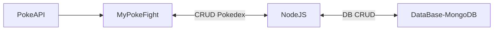

  

## Informations

This project is heading for the Pokemon World ! Its objective is create an CRA which will have many features, and everything with [Create React App](https://github.com/facebook/create-react-app).

We also used the PokeAPI [PokeAPI](https://pokeapi.co/)

  

## Features

- Pokedex → A list of all **Pokemons** from the 1st Generation to the latest with Pagination
  - `Details` : Shows stats about **Pokemons** such as `attack`, `speed`, `health`, `height`, etc
  - `Nav Bar` : Enter the name or the number of a **Pokemons** in order to find It

- User Account :accessibility: → You will be able to create an account with an username and a password. This gives the possibility to get 4 **Pokemons** randomly
  - `PokeAvatar` : Every users have a PokeAvatar that is given randomly and which will be the avatar of the account. This can't be modified.
  - `PokeCoins` : Earn 4 _PokeCoins_ at the creation of your account. One _PokeCoin_ gives you the chance to get 1 **Pokemons** randomly
  - `Shiny ✨` : **Pokemons** can be into their Shiny's form (only **Pokemons** that have Shiny's form)
  - `Mega-Evolution` : **Pokemons** can Mega-Evolve which causes stats boosts
    
- Battle Page 🆚 → Once you have at least 4 **Pokemons**, you can go fight with other users
  - `Team ⚔️` : Your team Fight has to have 4 **Pokemons**
  - `Earn 🥇` : Every win you earn 1 _PokeCoin_ you can use to get a new **Pokemon**
  

> **Note**  
> For `Mega-Evolution`, only those **Pokemons** id are available : 
> 3, 6, 9, 15, 18, 65, 80, 94, 115, 127, 130, 142, 150, 181, 208, 212, 214, 229, 248, 254, 257, 260, 282, 
    302, 303, 306, 308, 310, 319, 323, 334, 354, 359, 362, 373, 376, 380, 381, 384, 428, 445, 448, 460, 475, 531, 719

  

  
   Example of a Card → On mouse over there is the Shiny's form ✨ 

 

  
   Pokemon capable of Mega-Evolve 

 

## Libs
| Lib |
|:-------- |
| React     |
| Axios     |
| React-Bootstrap     |
| Router Dom     |

  

  

_[Anthony](https://www.linkedin.com/in/anthony-perozeni-b6840a233/) & [Carlos](https://www.linkedin.com/in/carlos-cancino-9a41a1224/)_
